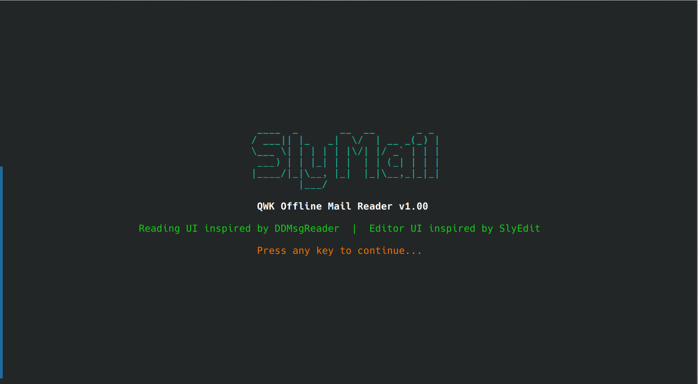
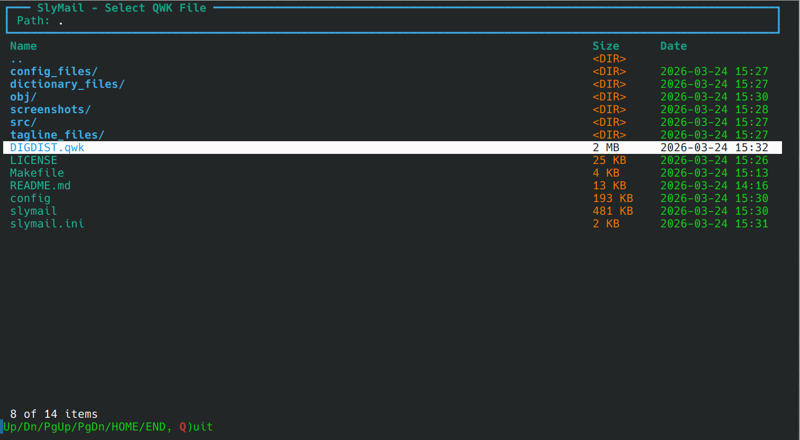
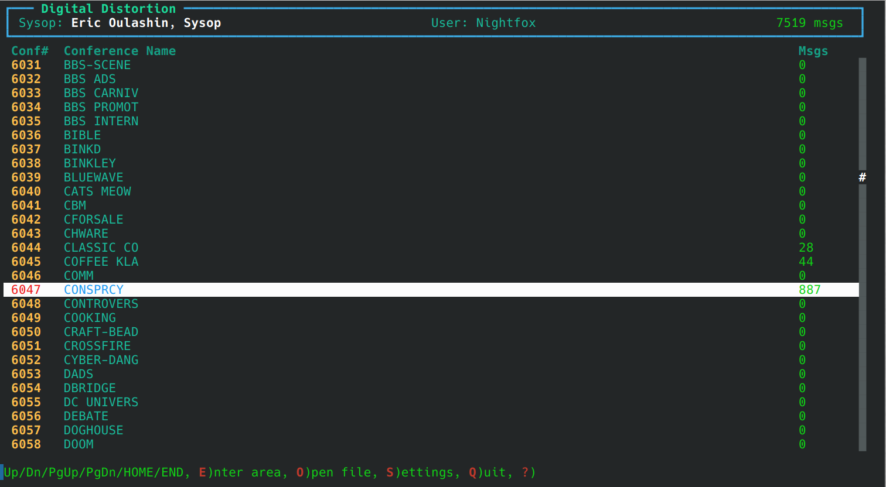
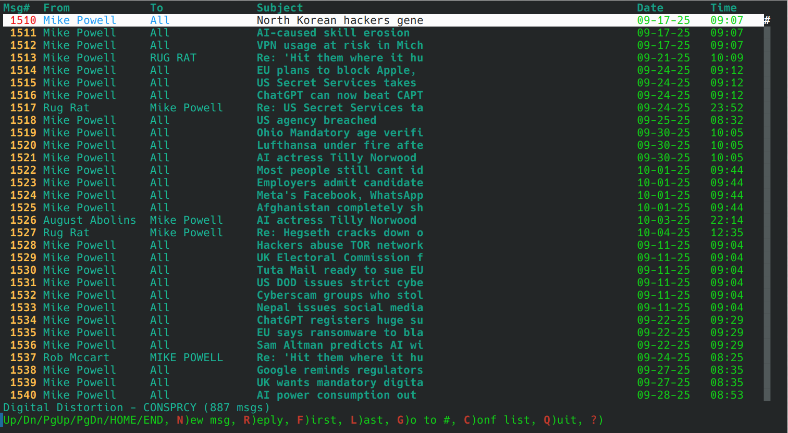
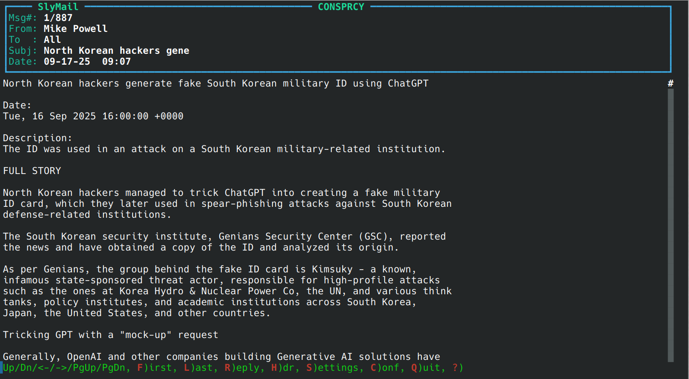
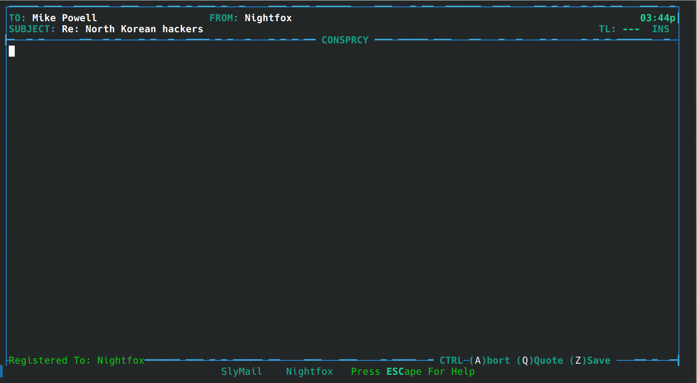
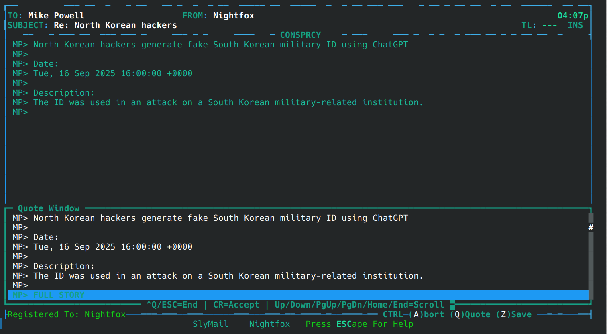
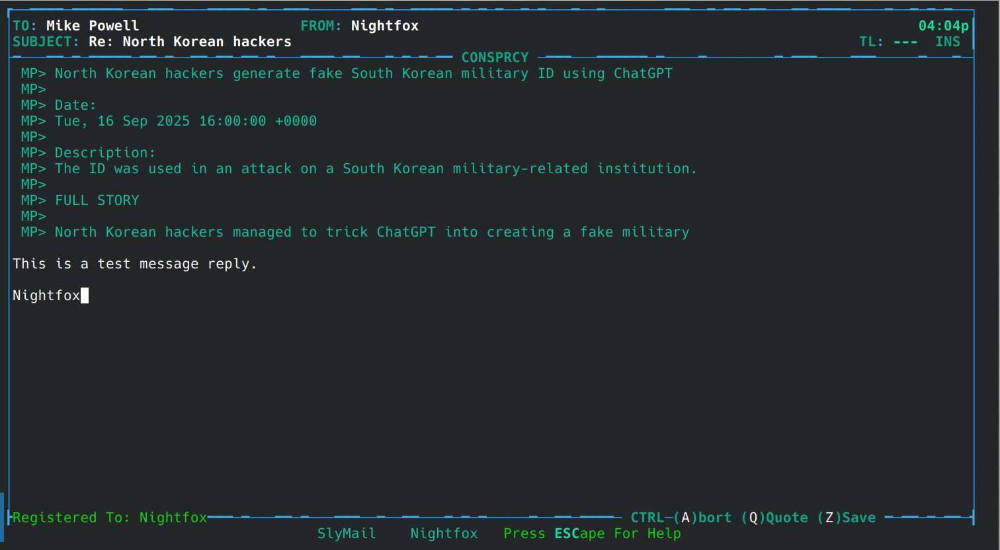

# SlyMail

This is a cross-platform text-based offline mail reader for the [QWK](https://en.wikipedia.org/wiki/QWK_(file_format)) packet format.  The QWK packet format was/is often used to exchange mail on [bulletin board systems](https://en.wikipedia.org/wiki/Bulletin_board_system).

SlyMail provides a full-featured interface for reading and replying to messages from BBS (Bulletin Board System) QWK mail packets. Its user interface is inspired by [Digital Distortion Message Reader (DDMsgReader)](https://github.com/SynchronetBBS/sbbs/tree/master/xtrn/DigDist/MsgReader) for message reading and [SlyEdit](https://github.com/SynchronetBBS/sbbs/tree/master/exec) for message editing, both originally created for [Synchronet BBS](https://www.synchro.net/).

## Features

### QWK Packet Support
- Opens and reads standard QWK mail packets (.qwk files)
- Parses CONTROL.DAT, MESSAGES.DAT, and NDX index files
- Supports HEADERS.DAT (QWKE extended format)
- Handles Synchronet-style conference numbering
- Creates REP reply packets (.rep files) for uploading back to the BBS
- Supports Microsoft Binary Format (MBF) float encoding in NDX files
- Remembers last opened QWK file and directory between sessions

### Message Reading (DDMsgReader-style)
- Conference list with message counts
- Scrollable message list with lightbar navigation
- Full message reader with header display (From, To, Subject, Date)
- Quote line highlighting (supports multi-level quoting)
- Kludge line display (optional)
- Scrollbar indicator
- Keyboard navigation: First/Last/Next/Previous message, Page Up/Down
- Help screens accessible with `?` or `F1` in all views

### Message Editor (inspired by SlyEdit)
- **Two visual modes**: Ice and DCT, each with distinct color schemes and layouts
- **Random mode**: Randomly selects Ice or DCT on each edit session
- **Alternating border colors**: Border characters randomly alternate between two theme colors, matching SlyEdit's visual style
- **Theme support**: Configurable color themes loaded from .ini files
- Full-screen text editor with word wrap
- Quote window for selecting and inserting quoted text (Ctrl-Q to open/close)
- Reply and new message composition
- ESC menu for save, abort, insert/overwrite toggle, and more
- **Ctrl-U user settings dialog** for configuring editor preferences on the fly
- **Style-specific yes/no prompts**: Ice mode uses a bottom-of-screen inline prompt; DCT mode uses a centered dialog box with themed colors

### Editor Settings (via Ctrl-U)
- **Choose UI mode**: Dialog to switch between Ice, DCT, and Random styles (takes effect immediately)
- **Select theme file**: Choose from available Ice or DCT color themes
- **Taglines**: When enabled, prompts for tagline selection on save (from `tagline_files/taglines.txt`)
- **Spell-check dictionary/dictionaries**: Select which dictionaries to use
- **Prompt for spell checker on save**: When enabled, offers to spell-check before saving
- **Wrap quote lines to terminal width**: Word-wrap quoted lines
- **Quote with author's initials**: Prepend quote lines with the author's initials (e.g., `MP> `)
- **Indent quote lines containing initials**: Add leading space before initials (e.g., ` MP> `)
- **Trim spaces from quote lines**: Strip leading whitespace from quoted text

### Color Themes
- Theme files are configuration files (`.ini`) in the `config_files/` directory
- Ice themes: `EditorIceColors_*.ini` (BlueIce, EmeraldCity, FieryInferno, etc.)
- DCT themes: `EditorDCTColors_*.ini` (Default, Default-Modified, Midnight)
- Theme colors use a simple format: foreground letter (`r`/`g`/`b`/`c`/`y`/`m`/`w`/`k`), optional `h` for bright, optional background digit (`0`-`7`)
- Themes control all UI element colors: borders, labels, values, quote window, help bar, yes/no dialogs

### Spell Checker
- Built-in spell checker using plain-text dictionary files
- Ships with English dictionaries (en, en-US, en-GB, en-AU, en-CA supplements)
- Interactive correction dialog: Replace, Skip, or Quit
- Dictionary files stored in the `dictionary_files/` directory

### Taglines
- Tagline files are stored in the `tagline_files/` directory
- The default tagline file is `tagline_files/taglines.txt`, one tagline per line
- Lines starting with `#` or `;` are treated as comments and ignored
- Select a specific tagline or choose one at random when saving a message
- Taglines are appended to messages with a `...` prefix

### REP Packet Creation
- When you write replies or new messages, they are queued as pending
- On exit (or when opening a new QWK file), SlyMail prompts to save pending messages
- Creates a standard `.rep` file (ZIP archive containing MESSAGES.DAT) for uploading to the BBS
- REP file is saved as `<BBS-ID>.rep` in the configured reply directory (or the QWK file's directory)

### Application Settings
- Persistent settings saved to user config directory
- Remembers last browsed directory and QWK filename
- Ctrl-L hotkey to load a different QWK file from conference or message list views
- Configurable quote prefix, quote line width, user name
- Reader options: show/hide kludge lines, tear/origin lines, scrollbar
- REP packet output directory

## Screenshots

<p align="center">
	<a href="screenshots/SlyMail_1_OpeningScreen.png" target='_blank'></a>
	<a href="screenshots/SlyMail_2_File_Chooser.png" target='_blank'></a>
	<a href="screenshots/SlyMail_3_msg_area_list.png" target='_blank'></a>
	<a href="screenshots/SlyMail_4_msg_list.png" target='_blank'></a>
	<a href="screenshots/SlyMail_5_reading_msg.png" target='_blank'></a>
	<a href="screenshots/SlyMail_6_msg_edit_start.png" target='_blank'></a>
	<a href="screenshots/SlyMail_7_quote_line_selection.png" target='_blank'></a>
	<a href="screenshots/SlyMail_8_writing_reply_msg.png" target='_blank'></a>
</p>

## Building

### Requirements

**Linux / macOS / BSD:**
- C++17 compatible compiler (GCC 8+, Clang 7+)
- ncurses development library (`libncurses-dev` on Debian/Ubuntu, `ncurses-devel` on Fedora/RHEL)
- `unzip` command (for extracting QWK packets)
- `zip` command (for creating REP packets)

**Windows:**
- MinGW-w64 or MSYS2 with GCC (C++17 support)
- Windows Console API (built-in)

### Build on Linux/macOS/BSD

```bash
make
```

This builds two programs:
- `slymail` - the main QWK reader application
- `config` - the standalone configuration utility

### Build with debug symbols

```bash
make debug
```

### Install (optional)

```bash
sudo make install    # Installs slymail and config to /usr/local/bin/
sudo make uninstall  # Remove
```

### Build on Windows (MinGW)

```bash
make
```

The Makefile automatically detects the platform and uses the appropriate terminal implementation:
- **Linux/macOS/BSD**: ncurses (`terminal_ncurses.cpp`)
- **Windows**: conio + Win32 Console API (`terminal_win32.cpp`)

## Usage

```bash
# Launch SlyMail with file browser
./slymail

# Open a specific QWK packet
./slymail MYBBS.qwk

# Run the standalone configuration utility
./config
```

### Configuration Program

The `config` utility provides a standalone text-based interface for configuring SlyMail settings without opening the main application. It offers four configuration categories:

- **Editor Settings** - All the same settings available via Ctrl-U in the editor (editor style, taglines, spell-check, quoting options, etc.)
- **Reader Settings** - Toggle kludge lines, tear lines, scrollbar, ANSI stripping, lightbar mode, reverse order
- **Theme Settings** - Select Ice and DCT color theme files from the `config_files/` directory
- **General Settings** - Set your name for replies and the REP packet output directory

Settings are saved automatically when exiting each category. Both SlyMail and the config utility read and write the same settings file.

### Key Bindings

#### Conference List
| Key | Action |
|-----|--------|
| Up/Down | Navigate conferences |
| Enter | Open selected conference |
| O / Ctrl-L | Open a different QWK file |
| S / Ctrl-U | Settings |
| Q / ESC | Quit SlyMail |
| ? / F1 | Help |

#### Message List
| Key | Action |
|-----|--------|
| Up/Down | Navigate messages |
| Enter / R | Read selected message |
| N | Write a new message |
| G | Go to message number |
| Ctrl-L | Open a different QWK file |
| S / Ctrl-U | Settings |
| C / ESC | Back to conference list |
| Q | Quit |
| ? / F1 | Help |

#### Message Reader
| Key | Action |
|-----|--------|
| Up/Down | Scroll message |
| Left/Right | Previous / Next message |
| F / L | First / Last message |
| R | Reply to message |
| K | Toggle kludge lines |
| Q / ESC | Back to message list |
| ? / F1 | Help |

#### Message Editor
| Key | Action |
|-----|--------|
| ESC | Editor menu (Save, Abort, etc.) |
| Ctrl-U | User settings dialog |
| Ctrl-Q | Open/close quote window |
| Ctrl-Z | Save message |
| Ctrl-A | Abort message |
| F1 | Help screen |
| Insert | Toggle Insert/Overwrite mode |

#### Quote Window
| Key | Action |
|-----|--------|
| Up/Down | Navigate quote lines |
| Enter | Insert selected quote line |
| Ctrl-Q / ESC | Close quote window |

## Architecture

SlyMail uses a platform abstraction layer for its text user interface:

```
ITerminal (abstract base class)
    ├── NCursesTerminal  (Linux/macOS/BSD - ncurses)
    └── Win32Terminal    (Windows - conio + Win32 Console API)
```

CP437 box-drawing and special characters are defined in `cp437defs.h` and rendered through the `putCP437()` method, which maps CP437 codes to platform-native equivalents (ACS characters on ncurses, direct CP437 bytes on Windows).

### Source Files

| File | Description |
|------|-------------|
| `terminal.h` | Abstract `ITerminal` interface, key/color constants, factory |
| `terminal_ncurses.cpp` | ncurses implementation with CP437-to-ACS mapping |
| `terminal_win32.cpp` | Windows Console API + conio implementation |
| `cp437defs.h` | IBM Code Page 437 character definitions |
| `colors.h` | Color scheme definitions (Ice, DCT, reader, list) |
| `theme.h` | Theme config file parser (Synchronet-style attribute codes) |
| `ui_common.h` | Shared UI helpers (dialogs, text input, scrollbar, etc.) |
| `qwk.h` / `qwk.cpp` | QWK/REP packet parser and creator |
| `settings.h` | User settings persistence |
| `settings_dialog.h` | Settings dialogs (editor and application) |
| `file_browser.h` | QWK file browser and selector |
| `msg_list.h` | Conference and message list views |
| `msg_reader.h` | Message reader (DDMsgReader-style) |
| `msg_editor.h` | Message editor (SlyEdit Ice/DCT-style) |
| `main.cpp` | SlyMail application entry point and main loop |
| `config.cpp` | Standalone configuration utility |

## Configuration

### Settings File

Settings are stored in an INI file named `slymail.ini` in the same directory as the SlyMail executable. This file is shared between both SlyMail and the `config` utility. The file is well-commented with descriptions of each setting.

Example `slymail.ini`:
```ini
[Editor]

; Editor style for writing messages: Ice, Dct, or Random
editorStyle=Ice

; Enable tagline insertion when saving a message
taglines=false

; Prompt the user to run the spell checker when saving a message
promptSpellCheck=false

[Reader]

; Show kludge/control lines (@MSGID, @REPLY, etc.) in the message reader
showKludgeLines=false

[Themes]

; Color theme file for the editor in Ice mode
iceThemeFile=EditorIceColors_BlueIce.ini

; Color theme file for the editor in DCT mode
dctThemeFile=EditorDCTColors_Default.ini
```

### Theme Files

Color themes are `.ini` files in the `config_files/` directory:

**Ice themes** (`EditorIceColors_*.ini`):
- BlueIce (default), EmeraldCity, FieryInferno, Fire-N-Ice, GeneralClean, GenericBlue, PurpleHaze, ShadesOfGrey

**DCT themes** (`EditorDCTColors_*.ini`):
- Default (default), Default-Modified, Midnight

Theme color values use a compact format derived from Synchronet attribute codes:
- `n` = normal (reset)
- Foreground: `k`=black, `r`=red, `g`=green, `y`=yellow, `b`=blue, `m`=magenta, `c`=cyan, `w`=white
- `h` = high/bright intensity
- Background digit: `0`=black, `1`=red, `2`=green, `3`=brown, `4`=blue, `5`=magenta, `6`=cyan, `7`=light gray

Example: `nbh` = normal blue bright, `n4wh` = bright white on blue background

### Taglines

Taglines are short quotes or sayings appended to the end of messages when saved. The tagline feature can be enabled via Ctrl-U in the editor or the `config` utility.

Taglines are stored in `tagline_files/taglines.txt`, one per line. Lines starting with `#` or `;` are treated as comments and ignored. When saving a message with taglines enabled, the user is prompted to either select a specific tagline or choose one at random. Selected taglines are appended to the message with a `...` prefix (e.g., `...To err is human, to really foul things up requires a computer.`).

### Spell Checker

SlyMail includes a built-in spell checker that uses plain-text dictionary files. The spell checker can be configured to prompt on save via Ctrl-U in the editor or the `config` utility.

**Dictionary files** are plain text files (one word per line) stored in `dictionary_files/`. Multiple dictionaries can be selected simultaneously for combined word coverage. SlyMail ships with:
- `dictionary_en.txt` - English (general, ~130K words)
- `dictionary_en-US-supplemental.txt` - US English supplement
- `dictionary_en-GB-supplemental.txt` - British English supplement
- `dictionary_en-AU-supplemental.txt` - Australian English supplement
- `dictionary_en-CA-supplemental.txt` - Canadian English supplement

When spell-checking is triggered, the checker scans the message for misspelled words and presents an interactive dialog for each one, offering options to **R**eplace the word, **S**kip it, **A**dd it (future), or **Q**uit checking.

## Credits

- UI inspired by [DDMsgReader](https://github.com/SynchronetBBS/sbbs) and [SlyEdit](https://github.com/SynchronetBBS/sbbs) by [Nightfox (Eric Oulashin)](https://github.com/nightfox)
- QWK format compatibility informed by [Synchronet BBS](https://www.synchro.net/) source code
- CP437 character definitions from Synchronet

## License

This project is open source software.
