> **注意：** 本文件为机器翻译。原文请参阅 [README.md](README.md)。

# SlyMail

这是一个跨平台的基于文本的离线邮件阅读器，支持 [QWK](https://en.wikipedia.org/wiki/QWK_(file_format)) 数据包格式。QWK 数据包格式曾被（现在也被）广泛用于 [公告板系统 (BBS)](https://en.wikipedia.org/wiki/Bulletin_board_system) 上的邮件交换。

SlyMail 提供了一个功能齐全的界面，用于阅读和回复来自 BBS（公告板系统）QWK 邮件数据包中的消息。其用户界面的灵感来源于消息阅读方面的 [Digital Distortion Message Reader (DDMsgReader)](https://github.com/SynchronetBBS/sbbs/tree/master/xtrn/DDMsgReader) 和消息编辑方面的 [SlyEdit](https://github.com/SynchronetBBS/sbbs/tree/master/exec)，两者均最初为 [Synchronet BBS](https://www.synchro.net/) 创建。

SlyMail 在 Claude AI 的帮助下创建。

## 功能

### QWK 数据包支持
- 打开并读取标准 QWK 邮件数据包（.qwk 文件）
- 解析 CONTROL.DAT、MESSAGES.DAT 和 NDX 索引文件
- 通过 HEADERS.DAT 提供完整的 QWKE（扩展 QWK）支持——基于偏移量的匹配，用于精确的扩展 To/From/Subject 字段、UTF-8 标志和 RFC822 Message-ID
- QWKE 消息体 kludge 解析（消息开头的 `To:`、`From:`、`Subject:`）
- 处理 Synchronet 风格的会议编号
- 创建用于上传回 BBS 的 REP 回复数据包（.rep 文件），包含扩展字段的 HEADERS.DAT 和待处理投票的 VOTING.DAT
- 支持 NDX 文件中的 Microsoft Binary Format (MBF) 浮点编码
- 在会话之间记住最后打开的 QWK 文件和目录

### 消息阅读（DDMsgReader 风格）
- 带消息计数的会议列表
- 带光标导航的可滚动消息列表
- 带标题显示（From、To、Subject、Date）的完整消息阅读器
- 引用行高亮显示（支持多级引用）
- Kludge 行显示（可选）
- 滚动条指示器
- 键盘导航：第一条/最后一条/下一条/上一条消息，向上/向下翻页
- 在所有视图中通过 `?` 或 `F1` 访问帮助屏幕

### BBS 颜色和属性代码支持
SlyMail 解释来自多个 BBS 软件包的颜色/属性代码，在消息阅读器和消息编辑器中将其渲染为彩色文本。支持的格式：
- **ANSI 转义码** — 始终启用；用于前景色、背景色、粗体的标准 SGR 序列（ESC[...m）
- **Synchronet Ctrl-A 代码** — `\x01` + 属性字符（例如，`\x01c` 表示青色，`\x01h` 表示亮色）
- **WWIV 心形代码** — `\x03` + 数字 0–9
- **PCBoard/Wildcat @X 代码** — `@X##`，其中两个十六进制数字编码背景色和前景色
- **Celerity 管道代码** — `|` + 字母（例如，`|c` 表示青色，`|W` 表示亮白色）
- **Renegade 管道代码** — `|` + 两位数字 00–31

每种 BBS 代码类型都可以通过阅读器设置或 `config` 工具中的 **属性代码开关** 子对话框单独启用或禁用。这些开关同时影响阅读器和编辑器。单独的 **去除 ANSI 代码** 选项在启用时会从消息中删除所有 ANSI 序列。

### 文件附件
- 检测消息正文中通过 `@ATTACH:` kludge 行引用的文件附件
- 当存在附件时，在消息标题中显示 **[ATT]** 指示器
- 在阅读器中按 **D** 或 **Ctrl-D** 下载附件——显示带大小的文件列表并提示选择目标目录

### 投票和调查（Synchronet QWKE）
SlyMail 支持用于调查和消息投票的 Synchronet VOTING.DAT 扩展：
- **调查**：被识别为调查的消息显示其回答选项以及投票数和百分比条。按 **V** 打开投票对话框，您可以切换选择并投票。
- **赞成/反对投票**：对于普通（非调查）消息，按 **V** 进行赞成或反对投票。当前投票统计和分数显示在消息标题中。
- **投票统计**：消息标题显示赞成/反对票数和净分数，如果您已经投票，则显示一个指示器。
- **投票排队**：投票与消息回复一起排队，并写入 REP 数据包中的 VOTING.DAT 以上传到 BBS。
- **调查浏览器**：从会议列表按 **V** 浏览数据包中的所有调查。

### UTF-8 支持
- 检测消息中的 UTF-8 内容（通过 HEADERS.DAT 的 `Utf8` 标志和 UTF-8 字节序列的自动检测）
- 在兼容终端上正确显示 UTF-8 字符
- 在 UTF-8 消息的消息标题中显示 **[UTF8]** 指示器
- 使用适当的编码保存新消息
- 旧版 BBS 内容的 CP437 到 UTF-8 转换
- 在 Linux/macOS/BSD 上设置区域设置（`setlocale(LC_ALL, "")`）并在 Windows 上设置 UTF-8 代码页，以实现正确的终端渲染

### 消息编辑器（受 SlyEdit 启发）
- **两种视觉模式**：Ice 和 DCT，各有不同的配色方案和布局
- **随机模式**：在每次编辑会话中随机选择 Ice 或 DCT
- **交替边框颜色**：边框字符在两种主题颜色之间随机交替，与 SlyEdit 的视觉风格保持一致
- **主题支持**：从 .ini 文件加载的可配置颜色主题
- 带自动换行的全屏文本编辑器
- 用于选择和插入引用文本的引用窗口（Ctrl-Q 打开/关闭）
- 回复和新消息撰写
- ESC 菜单，用于保存、中止、插入/覆盖切换等
- **Ctrl-K 颜色选择器**：打开一个对话框以选择前景色和背景色，并在光标位置插入 ANSI 转义码。支持 16 种前景色（8 种普通 + 8 种亮色）和 8 种背景色，带实时预览。按 **N** 插入重置代码。
- **颜色感知渲染**：编辑区域内联渲染 ANSI 和 BBS 属性代码，因此在您键入时显示彩色文本
- **Ctrl-U 用户设置对话框**，用于即时配置编辑器偏好
- **风格特定的是/否提示**：Ice 模式使用屏幕底部的内联提示；DCT 模式使用带主题颜色的居中对话框

### 编辑器设置（通过 Ctrl-U）
- **选择 UI 模式**：在 Ice、DCT 和 Random 风格之间切换的对话框（立即生效）
- **选择主题文件**：从可用的 Ice 或 DCT 颜色主题中选择
- **标签行**：启用时，保存时提示选择标签行（来自 `tagline_files/taglines.txt`）
- **拼写检查词典**：选择要使用的词典
- **保存时提示拼写检查**：启用时，在保存前提供拼写检查
- **将引用行换行到终端宽度**：对引用行进行自动换行
- **使用作者首字母引用**：在引用行前加上作者的首字母（例如，`MP> `）
- **缩进包含首字母的引用行**：在首字母前添加前导空格（例如，` MP> `）
- **修剪引用行中的空格**：去除引用文本中的前导空白

### 颜色主题
- 主题文件是 `config_files/` 目录中的配置文件（`.ini`）
- Ice 主题：`EditorIceColors_*.ini`（BlueIce、EmeraldCity、FieryInferno 等）
- DCT 主题：`EditorDCTColors_*.ini`（Default、Default-Modified、Midnight）
- 主题颜色使用简单格式：前景色字母（`r`/`g`/`b`/`c`/`y`/`m`/`w`/`k`），可选的 `h` 表示亮色，可选的背景数字（`0`-`7`）
- 主题控制所有 UI 元素颜色：边框、标签、值、引用窗口、帮助栏、是/否对话框

### 拼写检查器
- 使用纯文本词典文件的内置拼写检查器
- 随附英语词典（en、en-US、en-GB、en-AU、en-CA 补充）
- 交互式更正对话框：替换、跳过或退出
- 词典文件存储在 `dictionary_files/` 目录中

### 标签行
- 标签行文件存储在 `tagline_files/` 目录中
- 默认标签行文件为 `tagline_files/taglines.txt`，每行一个标签行
- 以 `#` 或 `;` 开头的行被视为注释并被忽略
- 保存消息时选择特定的标签行或随机选择一个
- 标签行以 `...` 前缀附加到消息

### REP 数据包创建
- 目前仅支持 ZIP（将来希望添加对更多压缩类型的支持）
- 当您撰写回复或新消息时，它们会被排队为待处理
- 投票（调查投票、赞成/反对票）也与回复一起排队
- 退出时（或打开新 QWK 文件时），SlyMail 提示保存所有待处理项目
- 创建用于上传到 BBS 的标准 `.rep` 文件（ZIP 归档），包含：
  - `<BBSID>.MSG` — 标准 QWK 格式的回复消息
  - `HEADERS.DAT` — 超过 25 个字符的字段的 QWKE 扩展标题
  - `VOTING.DAT` — Synchronet 兼容 INI 格式的待处理投票
- REP 文件保存为配置的回复目录（或 QWK 文件所在目录）中的 `<BBS-ID>.rep`

### 远程系统（Ctrl-R）
SlyMail 可以通过 FTP 或 SFTP (SSH) 直接从远程系统下载 QWK 数据包：
- 从文件浏览器按 **Ctrl-R** 打开远程系统目录
- **添加/编辑/删除** 远程系统条目：名称、主机、端口、连接类型（FTP 或 SSH）、用户名、密码、被动 FTP 开关和初始远程路径
- 使用类似本地文件浏览器的文件/目录浏览器 **浏览远程目录** — 导航进入目录，用 `..` 返回上级，用 `/` 跳转到根目录
- 将 QWK 文件直接 **下载** 到 SlyMail 数据目录的 `QWK` 子目录
- 远程系统条目持久保存到 SlyMail 数据目录中的 `remote_systems.json`
- 跟踪每个系统的最后连接日期/时间
- 使用系统的 `curl` 命令进行 FTP 和 SFTP 传输（无编译时库依赖）

### 应用程序设置
- 将持久设置保存到 SlyMail 数据目录（Linux/macOS/BSD 上为 `~/.slymail`，Windows 上为用户主目录）中的 `slymail.ini`
- SlyMail 数据目录及其 `QWK` 子目录在首次运行时自动创建
- 默认 QWK 文件浏览和 REP 数据包保存目录为 `~/.slymail/QWK`
- 记住最后浏览的目录和 QWK 文件名
- 在会议或消息列表视图中使用 Ctrl-L 热键加载不同的 QWK 文件
- 可配置的引用前缀、引用行宽度、用户名
- 阅读器选项：显示/隐藏 kludge 行、tear/origin 行、滚动条、去除 ANSI 代码
- 每个 BBS 的属性代码开关（Synchronet、WWIV、Celerity、Renegade、PCBoard/Wildcat）— 同时影响阅读器和编辑器
- REP 数据包输出目录

## 截图

<p align="center">
	<a href="screenshots/SlyMail_01_OpeningScreen.png" target='_blank'>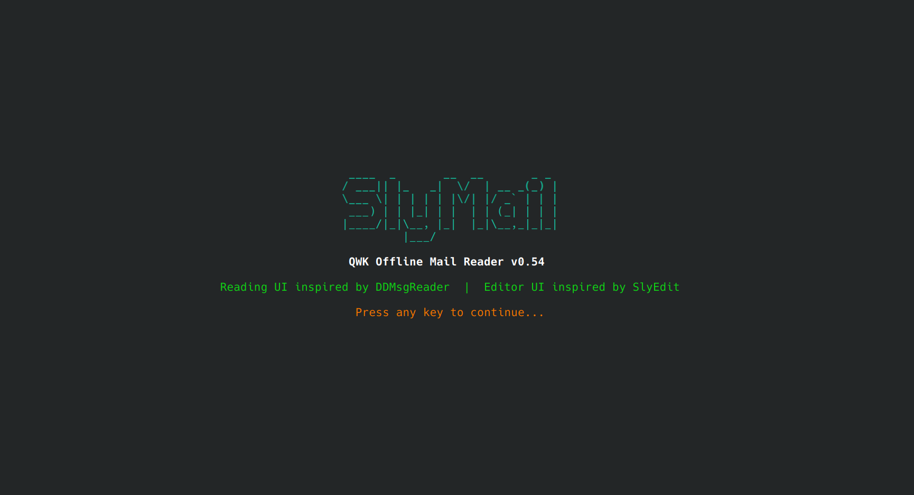</a>
	<a href="screenshots/SlyMail_02_File_Chooser.png" target='_blank'></a>
	<a href="screenshots/SlyMail_03_remote_system_list.png" target='_blank'></a>
	<a href="screenshots/SlyMail_04_Remote_System_Edit.png" target='_blank'></a>
	<a href="screenshots/SlyMail_05_Remote_System_Browsing.png" target='_blank'>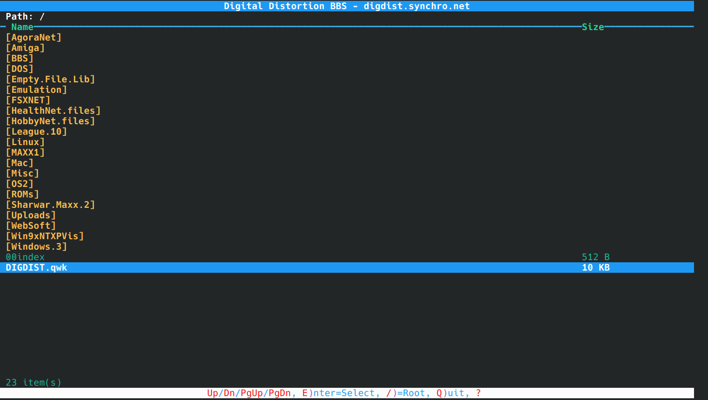</a>
	<a href="screenshots/SlyMail_06_msg_area_list.png" target='_blank'>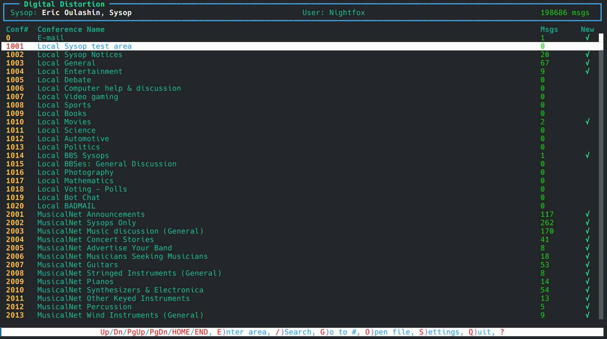</a>
	<a href="screenshots/SlyMail_07_msg_list.png" target='_blank'>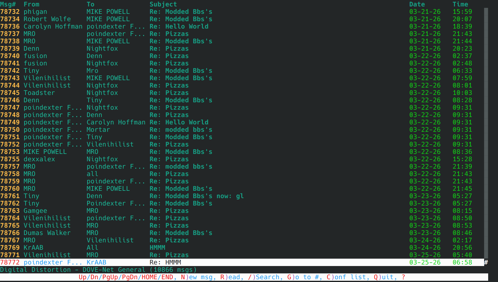</a>
	<a href="screenshots/SlyMail_08_reading_msg.png" target='_blank'>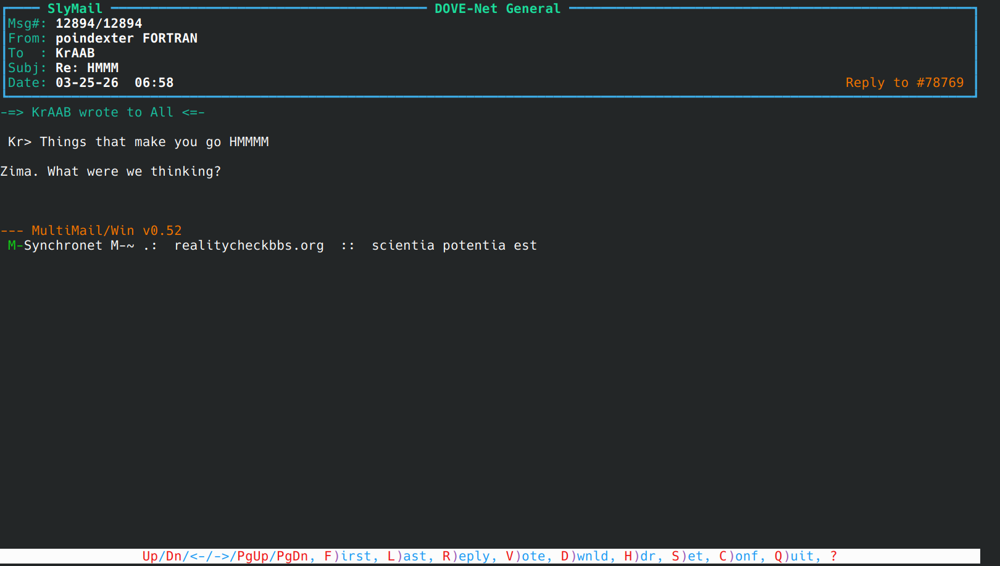</a>
	<a href="screenshots/SlyMail_09_msg_edit_start.png" target='_blank'>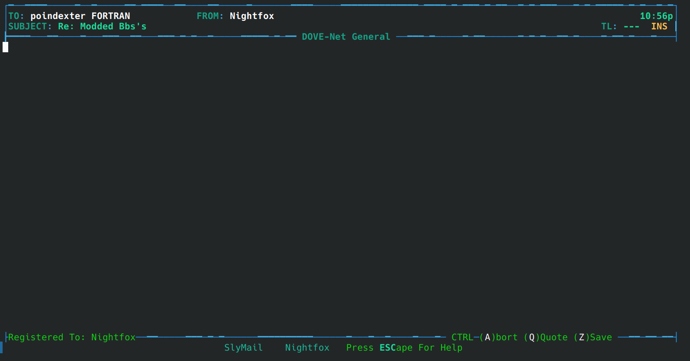</a>
	<a href="screenshots/SlyMail_10_quote_line_selection.png" target='_blank'>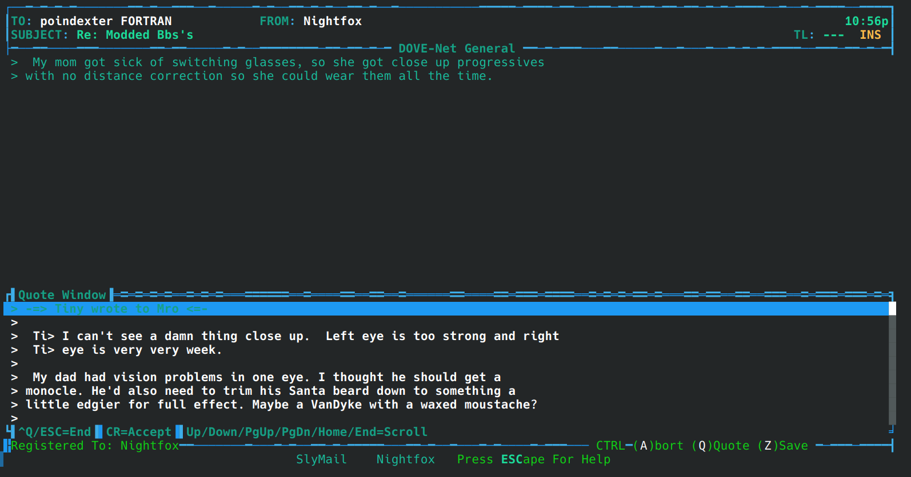</a>
	<a href="screenshots/SlyMail_11_writing_reply_msg.png" target='_blank'>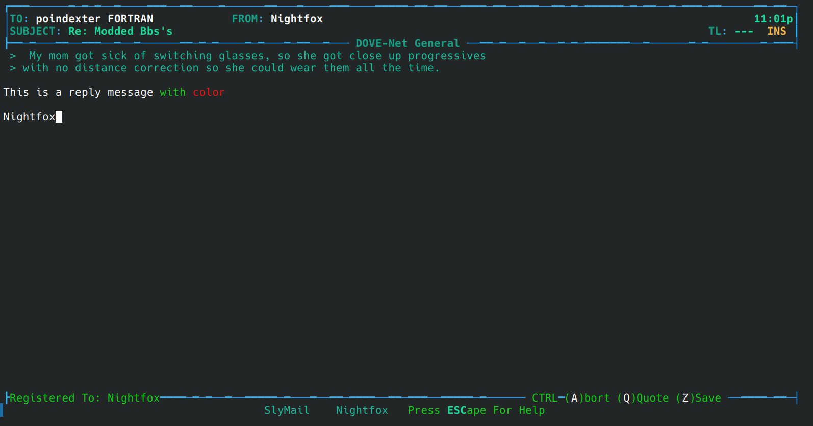</a>
	<a href="screenshots/SlyMail_12_editor_color_picker.png" target='_blank'>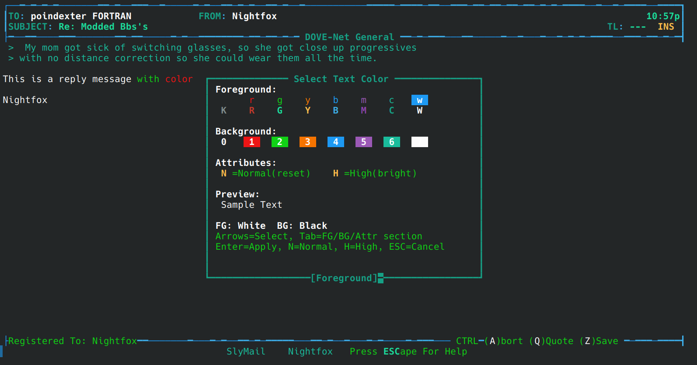</a>
	<a href="screenshots/SlyMail_13_Sync_poll_msg.png" target='_blank'>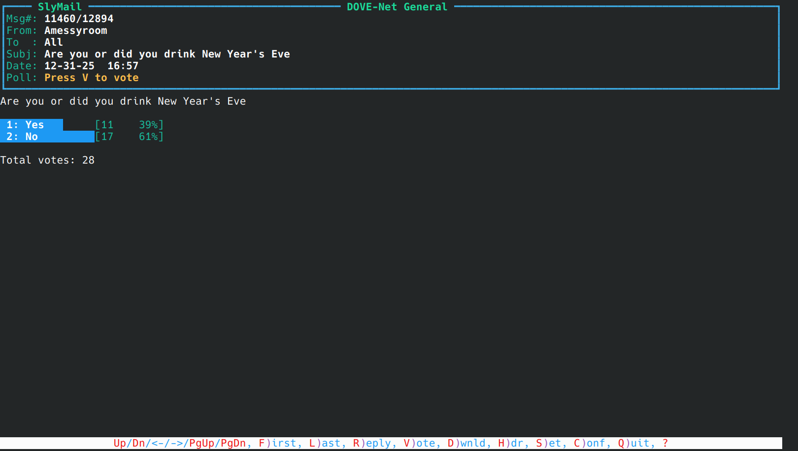</a>
	<a href="screenshots/SlyMail_14_reader_settings.png" target='_blank'>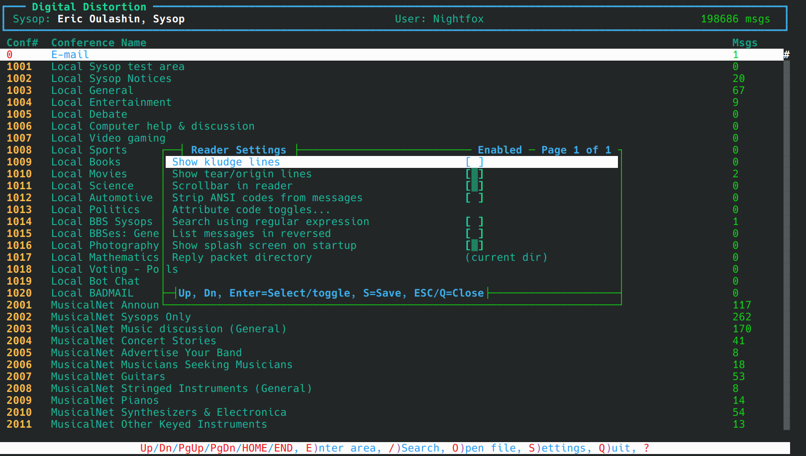</a>
	<a href="screenshots/SlyMail_15_editor_settings.png" target='_blank'>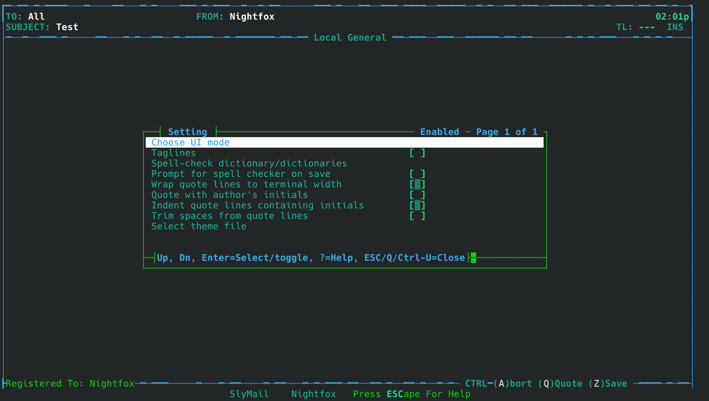</a>
	<a href="screenshots/SlyMail_16_msg_search.png" target='_blank'>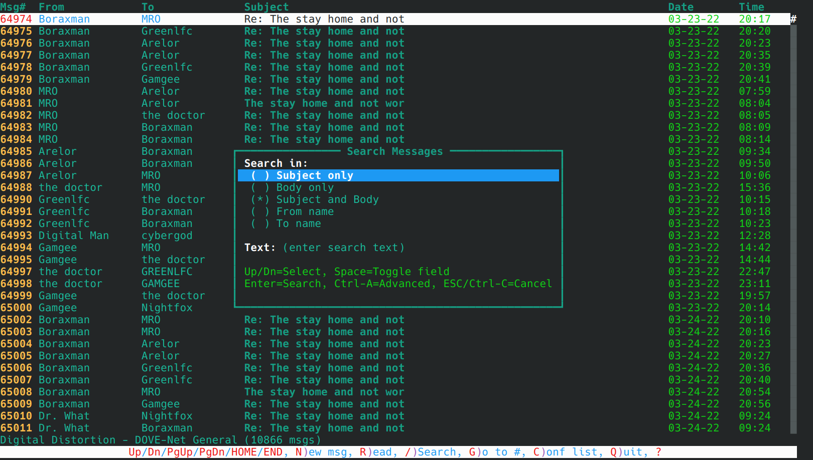</a>
	<a href="screenshots/SlyMail_17_Advanced_msg_search.png" target='_blank'>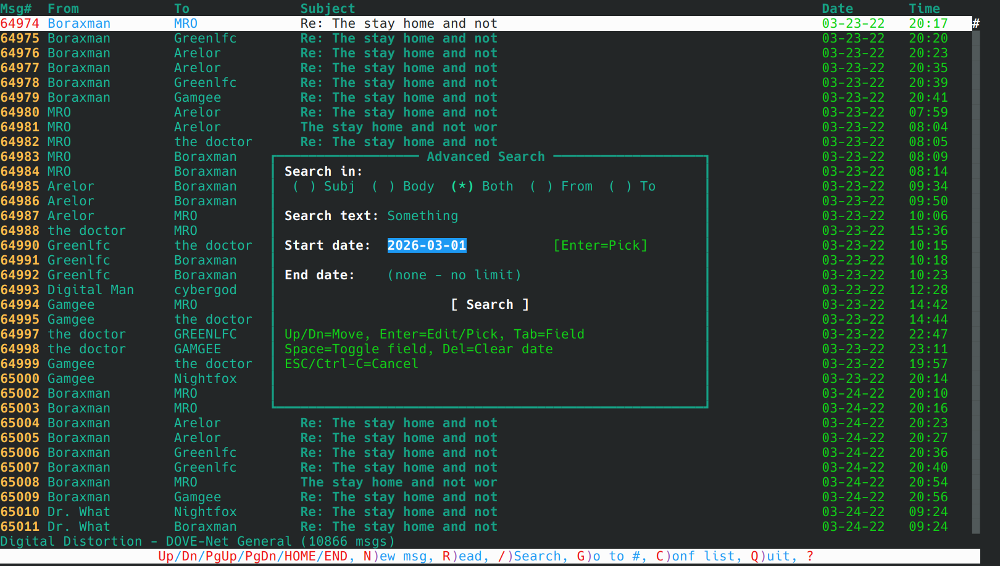</a>
	<a href="screenshots/SlyMail_18_advanced_msg_search_date_picker" target='_blank'></a>
	<a href="screenshots/SlyMail_19_config_program.png" target='_blank'>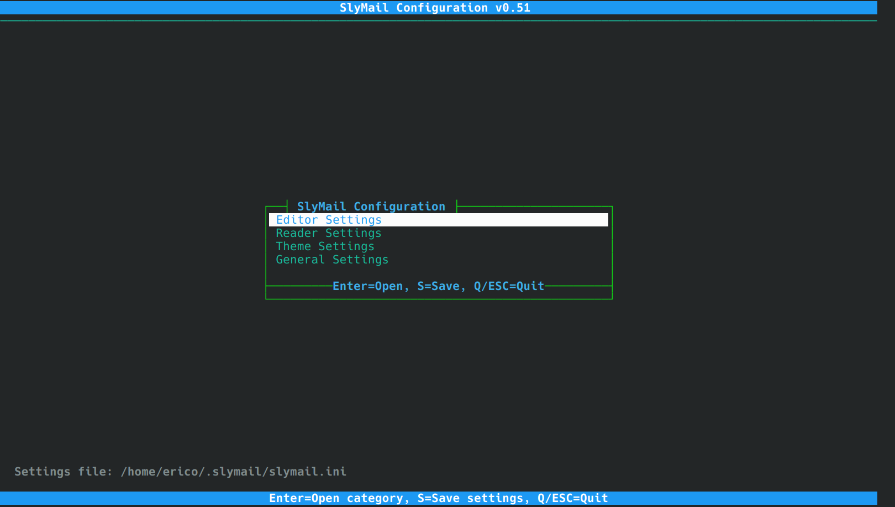</a>
	<a href="screenshots/SlyMail_20_reading_ANSI_art.png" target='_blank'></a>
	<a href="screenshots/SlyMail_21_reading_ANSI_art.png" target='_blank'></a>
	<a href="screenshots/SlyMail_22_reading_ANSI_art.png" target='_blank'></a>
	<a href="screenshots/SlyMail_23_reading_ANSI_art.png" target='_blank'></a>
</p>

## QWK 数据包的 Synchronet 设置
在 Synchronet BBS 上，在 QWK 数据包设置中，SlyMail 与 Ctrl-A 颜色代码、VOTING.DAT、文件附件以及 QWKE 数据包格式兼容（或应该兼容）。SlyMail 也应与 UTF-8 兼容。例如：
<table>
<tr><<td aligh='right'>Ctrl-A Color Codes</td><td>Leave in</td></tr>
<tr><<td aligh='right'>Archive Type</td><td>ZIP</td></tr>
<tr><<td aligh='right'>Include E-Mail Messages</td><td>Un-Read Only</td></tr>
<tr><<td aligh='right'>Include File Attachments</td><td>Yes</td></tr>
<tr><<td aligh='right'>Delete E-mail Automatically</td><td>No</td></tr>
<tr><<td aligh='right'>Include New Files List</td><td>Yes</td></tr>
<tr><<td aligh='right'>Include Index Files</td><td>Yes</td></tr>
<tr><<td aligh='right'>Include Control Files</td><td>Yes</td></tr>
<tr><<td aligh='right'>Include VOTING.DAT File</td><td>Yes</td></tr>
<tr><<td aligh='right'>Include HEADERS.DAT File</td><td>Yes</td></tr>
<tr><<td aligh='right'>Include Messages from You</td><td>No</td></tr>
<tr><<td aligh='right'>Include Time Zone (@TZ)</td><td>No</td></tr>
<tr><<td aligh='right'>Include Message Path (@VIA)</td><td>No</td></tr>
<tr><<td aligh='right'>Include Message/Reply IDs</td><td>No</td></tr>
<tr><<td aligh='right'>Include UTF-8 Characters</td><td>Yes</td></tr>
<tr><<td aligh='right'>MIME-encoded Message Text</td><td>No</td></tr>
<tr><<td aligh='right'>Extended (QWKE) Packet Format</td><td>Yes</td></tr>
</table>

## 构建

### 要求

**Linux / macOS / BSD：**
- C++17 兼容编译器（GCC 8+、Clang 7+）
- ncurses 开发库（Debian/Ubuntu 上为 `libncurses-dev`，Fedora/RHEL 上为 `ncurses-devel`）
- `unzip` 命令（用于解压 QWK 数据包）
- `zip` 命令（用于创建 REP 数据包）
- `curl` 命令（用于远程系统 FTP/SFTP 传输——可选，仅远程系统功能需要）

**Windows（Visual Studio 2022）：**
- 带有"使用 C++ 的桌面开发"工作负载的 Visual Studio 2022
- Windows SDK 10.0（包含在 VS 中）
- 无需额外库——使用内置 Win32 控制台 API 作为终端 UI，使用 `tar.exe` 或 PowerShell 处理 QWK/REP 数据包 ZIP（见下方说明）

**Windows（MinGW/MSYS2）：**
- 带有 GCC 的 MinGW-w64 或 MSYS2（C++17 支持）
- Windows 控制台 API（内置）

> **说明——Windows 上的 QWK/REP ZIP 处理：** SlyMail 在运行时检测哪个工具可用并使用最佳选项：
>
> - **`tar.exe`（首选）：** 随 Windows 10 版本 1803（2018 年 4 月更新）及更高版本以及所有版本的 Windows 11 一起提供。`tar` 根据内容而不是文件扩展名读取 ZIP 文件，因此 `.qwk` 数据包可以直接解压，`.rep` 数据包通过临时的 `.zip` 文件创建，然后重命名。无需额外配置。
> - **PowerShell（备用）：** 如果在 PATH 中找不到 `tar.exe`，SlyMail 会回退到 PowerShell。对于解压，它使用 .NET 的 `ZipFile` 类（`System.IO.Compression`）而不是 `Expand-Archive`，因为 `Expand-Archive` 即使文件是有效的 ZIP 归档，也会拒绝非 `.zip` 文件扩展名。对于 REP 数据包创建，它使用 `Compress-Archive`，同样写入临时 `.zip` 文件，然后重命名为 `.rep`。

### 在 Linux/macOS/BSD 上构建

```bash
make
```

这将构建两个程序：
- `slymail` - 主 QWK 阅读器应用程序
- `config` - 独立配置工具

### 使用调试符号构建

```bash
make debug
```

### 安装（可选）

```bash
sudo make install    # Installs slymail and config to /usr/local/bin/
sudo make uninstall  # Remove
```

### 在 Windows 上使用 Visual Studio 2022 构建

在 Visual Studio 2022 中打开解决方案文件：

```
vs\SlyMail.sln
```

或使用 MSBuild 从命令行构建：

```powershell
# Release build (output in vs\x64\Release\)
msbuild vs\SlyMail.sln /p:Configuration=Release /p:Platform=x64

# Debug build (output in vs\x64\Debug\)
msbuild vs\SlyMail.sln /p:Configuration=Debug /p:Platform=x64
```

这将构建两个可执行文件：
- `x64\Release\slymail.exe` — 主 QWK 阅读器
- `x64\Release\config.exe` — 独立配置工具

解决方案包含两个项目（`SlyMail.vcxproj` 和 `Config.vcxproj`），面向 x64、C++17，使用 MSVC v143 工具集。

### 在 Windows 上构建（MinGW/MSYS2）

```bash
make
```

Makefile 自动检测平台并使用适当的终端实现：
- **Linux/macOS/BSD**：ncurses（`terminal_ncurses.cpp`）
- **Windows**：conio + Win32 控制台 API（`terminal_win32.cpp`）

## 用法

```bash
# Launch SlyMail with file browser
./slymail

# Open a specific QWK packet
./slymail MYBBS.qwk

# Run the standalone configuration utility
./config
```

### 配置程序

`config` 工具提供了一个独立的基于文本的界面，用于在不打开主应用程序的情况下配置 SlyMail 设置。它提供四个配置类别：

- **编辑器设置** - 编辑器中通过 Ctrl-U 可用的所有相同设置（编辑器风格、标签行、拼写检查、引用选项等）
- **阅读器设置** - 切换 kludge 行、tear 行、滚动条、ANSI 去除、光标模式、逆序以及属性代码开关（每个 BBS 启用/禁用）
- **主题设置** - 从 `config_files/` 目录选择 Ice 和 DCT 颜色主题文件
- **常规设置** - 设置回复的名称和 REP 数据包输出目录

退出每个类别时自动保存设置。SlyMail 和 config 工具读写同一个设置文件。

### 键绑定

#### 文件浏览器
| 键 | 操作 |
|-----|--------|
| Up/Down | 浏览文件和目录 |
| Enter | 打开目录 / 选择 QWK 文件 |
| Ctrl-R | 打开远程系统目录 |
| Q / ESC | 退出 |

#### 会议列表
| 键 | 操作 |
|-----|--------|
| Up/Down | 浏览会议 |
| Enter | 打开选定的会议 |
| V | 查看数据包中的调查/投票 |
| O / Ctrl-L | 打开不同的 QWK 文件 |
| S / Ctrl-U | 设置 |
| Q / ESC | 退出 SlyMail |
| ? / F1 | 帮助 |

#### 消息列表
| 键 | 操作 |
|-----|--------|
| Up/Down | 浏览消息 |
| Enter / R | 阅读选定的消息 |
| N | 撰写新消息 |
| G | 转到消息编号 |
| Ctrl-L | 打开不同的 QWK 文件 |
| S / Ctrl-U | 设置 |
| C / ESC | 返回会议列表 |
| Q | 退出 |
| ? / F1 | 帮助 |

#### 消息阅读器
| 键 | 操作 |
|-----|--------|
| Up/Down | 滚动消息 |
| Left/Right | 上一条 / 下一条消息 |
| F / L | 第一条 / 最后一条消息 |
| R | 回复消息 |
| V | 投票（赞成/反对票或调查投票） |
| D / Ctrl-D | 下载文件附件 |
| H | 显示消息标题信息 |
| S / Ctrl-U | 设置 |
| C / Q / ESC | 返回消息列表 |
| ? / F1 | 帮助 |

#### 消息编辑器
| 键 | 操作 |
|-----|--------|
| ESC | 编辑器菜单（保存、中止等） |
| Ctrl-U | 用户设置对话框 |
| Ctrl-Q | 打开/关闭引用窗口 |
| Ctrl-K | 颜色选择器（在光标位置插入 ANSI 颜色代码） |
| Ctrl-G | 按代码插入 CP437 图形字符 |
| Ctrl-W | 单词/文本搜索 |
| Ctrl-S | 更改主题 |
| Ctrl-D | 删除当前行 |
| Ctrl-Z | 保存消息 |
| Ctrl-A | 中止消息 |
| F1 | 帮助屏幕 |
| Insert | 切换插入/覆盖模式 |

#### 引用窗口
| 键 | 操作 |
|-----|--------|
| Up/Down | 浏览引用行 |
| Enter | 插入选定的引用行 |
| Ctrl-Q / ESC | 关闭引用窗口 |

## 架构

SlyMail 为其文本用户界面使用平台抽象层：

```
ITerminal (abstract base class)
    ├── NCursesTerminal  (Linux/macOS/BSD - ncurses)
    └── Win32Terminal    (Windows - conio + Win32 Console API)
```

CP437 方框绘制和特殊字符在 `cp437defs.h` 中定义，并通过 `putCP437()` 方法渲染，该方法将 CP437 代码映射到平台原生等效项（ncurses 上的 ACS 字符，Windows 上的直接 CP437 字节）。

### 源文件

| 文件 | 描述 |
|------|-------------|
| `terminal.h` | 抽象 `ITerminal` 接口、键/颜色常量、工厂 |
| `terminal_ncurses.cpp` | 带 CP437 到 ACS 映射的 ncurses 实现 |
| `terminal_win32.cpp` | Windows 控制台 API + conio 实现 |
| `cp437defs.h` | IBM 代码页 437 字符定义 |
| `colors.h` | 配色方案定义（Ice、DCT、阅读器、列表） |
| `theme.h` | 主题配置文件解析器（Synchronet 风格属性代码） |
| `ui_common.h` | 共享 UI 助手（对话框、文本输入、滚动条等） |
| `qwk.h` / `qwk.cpp` | QWK/REP 数据包解析器和创建器（QWKE、附件、投票） |
| `bbs_colors.h` / `bbs_colors.cpp` | BBS 颜色/属性代码解析器（ANSI、Synchronet、WWIV、PCBoard、Celerity、Renegade） |
| `utf8_util.h` / `utf8_util.cpp` | UTF-8 工具（验证、显示宽度、CP437 到 UTF-8 转换） |
| `voting.h` / `voting.cpp` | VOTING.DAT 解析器、投票统计、调查显示 UI |
| `remote_systems.h` / `remote_systems.cpp` | 远程系统目录、FTP/SFTP 浏览、JSON 持久化、主目录工具 |
| `settings.h` | 用户设置持久化 |
| `settings_dialog.h` | 设置对话框（编辑器、阅读器、属性代码开关） |
| `file_browser.h` | QWK 文件浏览器和选择器 |
| `msg_list.h` | 会议和消息列表视图 |
| `msg_reader.h` | 带投票和附件 UI 的消息阅读器（DDMsgReader 风格） |
| `msg_editor.h` | 带颜色选择器的消息编辑器（SlyEdit Ice/DCT 风格） |
| `main.cpp` | SlyMail 应用程序入口点和主循环 |
| `config.cpp` | 独立配置工具 |

## 配置

### 设置文件

设置存储在与 SlyMail 可执行文件同目录下名为 `slymail.ini` 的 INI 文件中。此文件由 SlyMail 和 `config` 工具共享。文件中有各设置描述的注释。

`slymail.ini` 示例：
```ini
[Editor]

; Editor style for writing messages: Ice, Dct, or Random
editorStyle=Ice

; Enable tagline insertion when saving a message
taglines=false

; Prompt the user to run the spell checker when saving a message
promptSpellCheck=false

[Reader]

; Show kludge/control lines (@MSGID, @REPLY, etc.) in the message reader
showKludgeLines=false

; Strip ANSI escape codes from message text
stripAnsi=false

; Attribute code toggles (affect both reader and editor)
attrSynchronet=true
attrWWIV=true
attrCelerity=true
attrRenegade=true
attrPCBoard=true

[Themes]

; Color theme file for the editor in Ice mode
iceThemeFile=EditorIceColors_BlueIce.ini

; Color theme file for the editor in DCT mode
dctThemeFile=EditorDCTColors_Default.ini
```

### 主题文件

颜色主题是 `config_files/` 目录中的 `.ini` 文件：

**Ice 主题**（`EditorIceColors_*.ini`）：
- BlueIce（默认）、EmeraldCity、FieryInferno、Fire-N-Ice、GeneralClean、GenericBlue、PurpleHaze、ShadesOfGrey

**DCT 主题**（`EditorDCTColors_*.ini`）：
- Default（默认）、Default-Modified、Midnight

主题颜色值使用源自 Synchronet 属性代码的紧凑格式：
- `n` = 正常（重置）
- 前景色：`k`=黑色、`r`=红色、`g`=绿色、`y`=黄色、`b`=蓝色、`m`=品红、`c`=青色、`w`=白色
- `h` = 高亮/亮色
- 背景数字：`0`=黑色、`1`=红色、`2`=绿色、`3`=棕色、`4`=蓝色、`5`=品红、`6`=青色、`7`=浅灰

示例：`nbh` = 正常蓝色亮色，`n4wh` = 蓝色背景上的亮白色

### 标签行

标签行是保存消息时附加到消息末尾的简短引用或格言。标签行功能可以通过编辑器中的 Ctrl-U 或 `config` 工具启用。

标签行存储在 `tagline_files/taglines.txt` 中，每行一个。以 `#` 或 `;` 开头的行被视为注释并被忽略。启用标签行保存消息时，系统会提示您选择特定的标签行或随机选择一个。所选标签行以 `...` 前缀附加到消息（例如，`...To err is human, to really foul things up requires a computer.`）。

### 拼写检查器

SlyMail 包含一个使用纯文本词典文件的内置拼写检查器。拼写检查器可以通过编辑器中的 Ctrl-U 或 `config` 工具配置为在保存时提示。

**词典文件**是存储在 `dictionary_files/` 中的纯文本文件（每行一个单词）。可以同时选择多个词典以合并单词覆盖范围。SlyMail 随附：
- `dictionary_en.txt` - 英语（通用，约 13 万个单词）
- `dictionary_en-US-supplemental.txt` - 美国英语补充
- `dictionary_en-GB-supplemental.txt` - 英国英语补充
- `dictionary_en-AU-supplemental.txt` - 澳大利亚英语补充
- `dictionary_en-CA-supplemental.txt` - 加拿大英语补充

触发拼写检查时，检查器会扫描消息中的拼写错误单词，并为每个单词显示一个交互式对话框，提供选项：**R** 替换单词、**S** 跳过、**A** 添加（将来）或 **Q** 退出检查。

## 致谢

- UI 受 [Nightfox (Eric Oulashin)](https://github.com/EricOulashin) 的 [DDMsgReader](https://github.com/SynchronetBBS/sbbs) 和 [SlyEdit](https://github.com/SynchronetBBS/sbbs) 启发
- QWK 格式兼容性参考了 [Synchronet BBS](https://www.synchro.net/) 源代码
- CP437 字符定义来自 Synchronet

## 许可证

此项目是开源软件。
